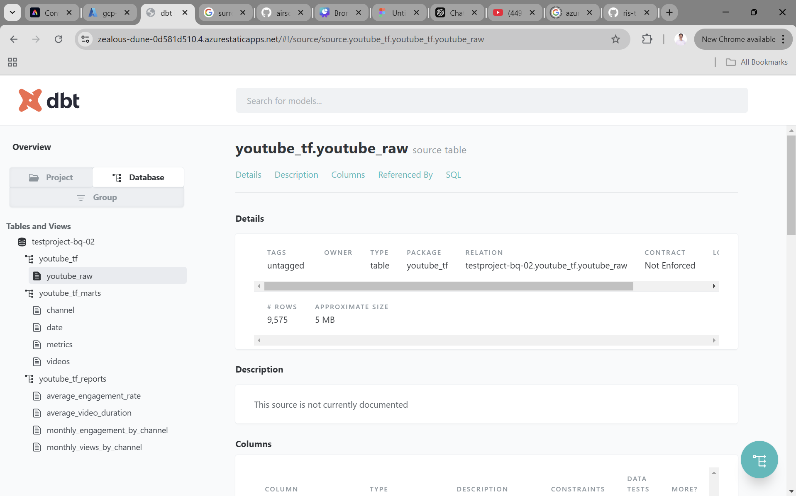
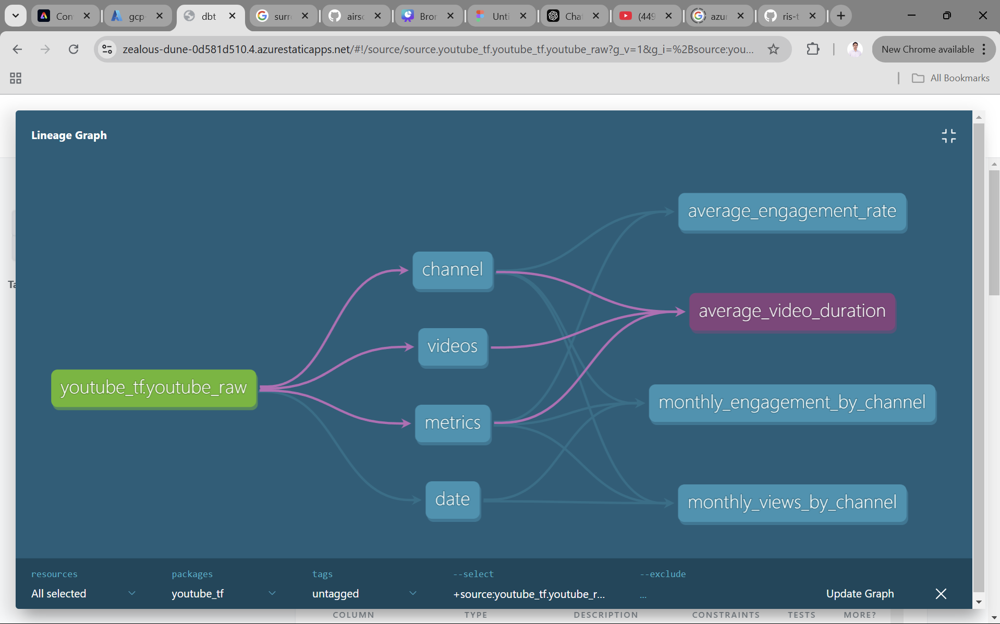

# YouTube ELT Data Pipeline with GCP and Airflow

## Table of Contents
1. [Project Overview](#project-overview)
2. [Key Features](#key-features)
3. [Prerequisites](#prerequisites)
4. [Quick Start](#quick-start)
5. [ELT Pipeline Run](#elt-pipeline-run)
6. [Metabase Dashboard](#metabase-dashboard)
7. [Project Summary](#project-summary)
8. [Future Enhancements](#future-enhancements)

## Project Overview
This ELT project extracts YouTube data using the YouTube API, uploads it to Google Cloud Storage (GCS), and loads it into BigQuery. Terraform is used to provision the GCP infrastructure (GCS bucket and BigQuery dataset/table). dbt transforms the raw data into marts (fact and dimension tables) and generates final reporting tables. Metabase visualizes insights from the transformed data, and Apache Airflow orchestrates the entire pipeline


*Note: This project utilizes Astronomer, a managed service that simplifies Apache Airflow management, and runs all services inside Docker containers.*

## Key Features
This section contains the main functionalities and capabilities of ELT Pipeline:

1. **YouTube Data Extraction**
   - Fetches YouTube channel statistics (e.g., subscribers, total views, total videos) and video details (e.g., views, likes, comments, duration) using the YouTube Data API

   - Supports multiple YouTube channels for analysis

2. **Infrastructure as Code**
   - Uses Terraform to programmatically provision and manage GCP resources, including Google Cloud Storage (GCS) buckets and BigQuery datasets

3. **Google Cloud Integration**
   - Stores raw YouTube data in Google Cloud Storage (GCS) for durability and accessibility

   - Loads raw data into BigQuery for efficient querying and analysis

4. **Data Transformation with dbt**
   - Transforms raw data into structured marts (fact and dimension tables) using dbt

   - Generates final reporting tables for analytics and visualization

5. **Airflow Orchestration**
   - Automates and orchestrates the entire pipeline, from data extraction to transformation and loading

6. **Metabase Integration**
   - Visualizes key metrics (e.g., channel performance, video engagement) using Metabase dashboards

7. **End-to-End Automation**
   - Combines multiple tools (YouTube API, Terraform, GCP, dbt, Airflow, Metabase) into a seamless, automated workflow

   - Reduces manual intervention and ensures consistent pipeline execution

## Prerequisites
1. **GCP Subscriptions**
   - A valid GCP subscription is required to provision and manage cloud resources, including Google Cloud Storage (GCS) and BigQuery, which are used in this pipeline

   - The GCP subscription is also used to access the `YouTube Data API`

2. **GCP Service Account**
   - A GCP service account with appropriate permissions is required to interact with GCS, BigQuery, and other GCP services

   - The service account key file must be configured in Airflow as a connection (gcp)

3. **Youtube Channel ID's**
   - The YouTube Channel IDs for the channels to be analyzed must be provided. These are stored as **Airflow variables** (MiawAug, Windah Basudara)

4. **Astro CLI**
   - The Astro CLI is required to run Apache Airflow within a Docker container, simplifying orchestration and dependency management

5. **Docker Desktop**
   - Docker is required to containerize and run Airflow using Astro, ensuring a consistent runtime environment

6. **Terraform**
   - Terraform is used for Infrastructure as Code (IaC) to provision GCP resources programmatically. It is installed inside the Docker container (via the `Dockerfile`) for deployment automation

7. **dbt Core**
   - dbt Core is used for data transformations. It processes raw data into marts (fact and dimension tables) and generates final reporting tables. The dbt project is configured within the pipeline and is installed inside the Docker container (via the `Dockerfile`)

8. **Metabase**
   - Metabase is used for data visualization and dashboarding. It connects to the transformed data in BigQuery to provide insights into YouTube channel performance and video metrics. It is installed inside the Docker container using the `docker-compose.override.yml` file

## Quick Start
Follow these steps to quickly set up and run the YouTube Data Pipeline:

1. **Clone this repository**
    - Bash command:

        ```bash
        git clone https://github.com/johadamas/gcp-e2e-pipeline.git
        ```
2. **Create a GCP Project**
   - Manually create a GCP project in the Google Cloud Console

   - Note down the **Project ID**; you will need it for Terraform and Airflow configurations

3. **Create Service Account**
   - Create a GCP Service Account with the necessary permissions for GCS and BigQuery (Storage Admin and BigQuery Admin)

   - Download the Service Account key file (JSON) and place it in the following path:

      ```bash
         /usr/local/airflow/include/gcp/your_service_account_key.json
      ```

4. **Get Youtube API**
   - Obtain a YouTube Data API key from the Google Cloud Console

   - Save the API key; you will need it to configure Airflow variables

5. **Get Youtube Channel ID's**
   - Identify the YouTube Channel IDs you want to analyze (e.g., MiawAug, Windah Basudara)

   - Save these IDs; you will need them to configure Airflow variables

6. **Start Docker Containers**
   - Ensure Docker Desktop is running

   - Start the Airflow and Metabase containers using the following command:

      ```bash
         astro dev start
      ```

7. **Configure Terraform**
   - In the project directory, open the `providers.tf` located in this path:

      ```bash
         /usr/local/airflow/include/terraform/providers.tf
      ```

   - Update this part of the `providers.tf` file with the GCP Project you created

      ```hcl
         provider "google" {
            project = "YOUR_PROJECT_NAME"
            region  = "YOUR_PROJECT_REGION"
            zone    = "YOUR_PROJECT_ZONE"
            credentials = file("/usr/local/airflow/include/gcp/service_account.json")
         }
      ```

   - In the project directory, open the `main.tf` located in this path:

      ```bash
         /usr/local/airflow/include/terraform/main.tf
      ```

   - Update this part of the `main.tf` file with the GCP Project you created

      ```hcl
         resource "google_bigquery_dataset" "bq_dataset" {
            dataset_id  = "youtube_tf"
            location    = "US"
            project     = "YOUR_PROJECT_ID"
            
            labels = {
               env  = "dev"
            }
         }
      ```

8. **Configure Airflow Variables**
   - Open the Airflow UI at http://localhost:8089
   
   - Add the following **Airflow Variables:**
      - `YT_API_KEY`: Your YouTube Data API key.

      - `MiawAug`: YouTube Channel ID for MiawAug

      - `WindahB`: YouTube Channel ID for Windah Basudara

      

   - Add the **GCP Connection:**
      - Connection ID: `gcp`
      - Connection Type: `Google Cloud`
      - Keyfile Path: `/usr/local/airflow/include/gcp/your_service_account_key.json`

      

9. **Run the Pipeline**
   - In the Airflow UI, locate the youtube_pipeline DAG
   - Trigger the DAG manualy to start the pipeline
   - Monitor the pipeline's progress in the Airflow UI

      

--- 

**Notes**
   - Replace placeholders (e.g., your_service_account_key.json, YT_API_KEY) with your actual values
   
   - Ensure all prerequisites (e.g., Docker, Astro CLI, GCP Service Account) are set up before proceeding

   - Terraform will provision the GCS bucket and BigQuery dataset. Ensure the GCP project is created manually before running the pipeline

## ELT Pipeline Run
1. **Airflow DAG**:
   - Airflow orchestrates the entire ELT pipeline with the following tasks:

      

   - **Complete tasks run:**

      

2. **Task Dependencies**:
- The pipeline tasks are executed in the following order:

   ```plaintext
   get_youtube_data -> terraform_tasks -> upload_to_gcs -> load_data_to_bq -> transform_marts -> transform_report
   ```

- **get_youtube_data**
   - Fetches channel statistics and video details, filters the data, and saves it to a local CSV file temporarily

- **terraform_tasks**
   - `terraform_init`: Initializes the Terraform working directory
   - `terraform_apply`: Applies the Terraform configuration to provision GCP infrastructure

- **upload_to_gcs**
   - Uploads the generated CSV file to a specified Google Cloud Storage bucket

      

- **load_to_bigquery**
   - Loads the raw data from GCS into a BigQuery table

      

- **transform_marts**
   - Transforms the raw data into marts with dbt with added test like `unique`, `not_null` and `relationship`:

      

- **transform_report**
   - Generates final report tables from marts

      

3. **dbt Documentations**
- **Overview**
   - Use the dbt docs site to explore models, sources, and transformations in detail

      

- **Lineage**
   - The lineage graph provides a visual overview of dependencies between raw data, marts, and reporting tables

      

## Metabase Dashboard
1. **Dashboard Overview**
   
   The Metabase dashboard provides insights into key YouTube metrics, including channel performance, video views, and engagement trends. It helps users analyze and compare the performance of YouTube channels effectively

      - **Here’s a preview of the dashboard in action**:

         

         *Note: The dashboard is mainly consist of 3 pages, which is `overview`, `engagement` and `revenue`*

2. **Page Breakdown**
- **A. Overview**

   This page compares key metrics between **MiawAug** and **Windah Basudara**, including:

   - `Average Views per Video`: Bar chart comparing the average views per video
   - `Monthly Views by Channels`: Line chart showing monthly view trends
   - `Total Videos vs Total Views`: Bar chart with a line overlay comparing total videos and views
   - `Average Views by Video Duration`: Categorizes videos as SHORT (<5 min), MEDIUM (5-20 min), and LONG (>20 min) and compares their average views

      

- **B. Engagement**

   This page focuses on engagement metrics, providing insights into how viewers interact with the content of both channels. Key metrics include:

   - `Monthly Engagement by Channels`: Line chart showing engagement trends over time
   - `Average Engagement Rate by Channels`: Bar chart comparing engagement rates (likes, comments, views)
   - `Top 3 Most Engaging Videos`: List of the most engaging videos based on user interactions

      

- **C. Revenue**

   This section provides estimated revenue insights for **MiawAug** and **Windah Basudara** Youtube Channel:

   - `Average Monthly Revenue`: Card displaying the average monthly revenue
   - `Estimated Monthly Revenue`: Bar chart showing estimated monthly revenue over time
   - `Estimated Yearly Revenue`: Bar chart displaying estimated yearly revenue

      - **MiawAug:**
      

      - **Windah Basudara:**
      

--- 

**Notes**
   - **Engagement Rate** = (Total Likes + Total Comments) / Total Views
   - **Monthly Revenue** = ((Monthly Views × CPM) / 1000) × 16500
   - **CPM (Cost per 1K Views): EUR 1.08** (based on isthischannelmonetized.com for Indonesia)
   - Exchange Rate: 1 EUR = 16,500 IDR (as of now)

   - Data Extracted On: December 18, 2024

## Conclusion
The ELT pipeline automates data extraction and transformation using a single Airflow DAG, with cloud resources (GCS and BigQuery) provisioned via Terraform. However, the GCP project itself must be manually created before deployment. Additionally, dbt transformations run [inside Docker / locally], requiring appropriate dependencies inside the container if using Docker. While the pipeline performs well, there is still room for improvement

## Future Enhancements
- Implement incremental data processing for better efficiency
- Introduce robust data validation and quality checks using Great Expectations
- Expand dbt transformations to support advanced metrics
- Implement Change Data Capture (CDC) for real-time updates
- Add Terraform outputs to clarify expected results after provisioning

## License
This project is licensed under the MIT License. See the [LICENSE](LICENSE) file for details.
