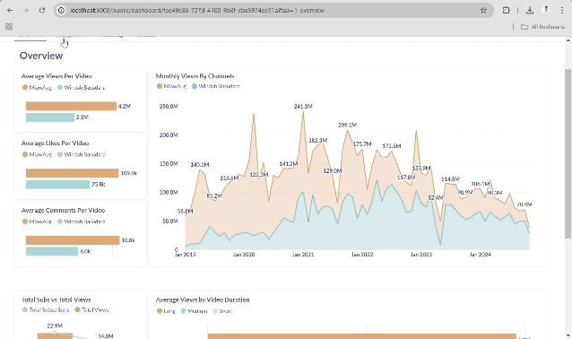

# YouTube Data Pipeline with Airflow

This project implements an Airflow DAG to fetch YouTube channel and video data using the YouTube Data API, transform it, and load it into Google Cloud Storage (GCS) and BigQuery. The DAG also includes Terraform tasks for infrastructure setup and dbt transformations for marts and reports model.

## Architecture


This project utilize Astronomer, a managed service that simplifies Apache Airflow management and contained all of the service inside a docker container

### Tasks Run

1. **Fetch YouTube Data**:  
   Retrieve YouTube channel stats and video details using the YouTube API, and saves it to a local CSV file temporarily
   
2. **Terraform Tasks**:
   Provision GCP infrastructure with Terraform (GCS and BigQuery)

3. **Upload Youtube Data to GCS**:  
   Uploads the generated CSV file to a specified GCS bucket.

4. **Load raw data to BigQuery**:  
   Loads the raw data from GCS into a BigQuery table.

5. **Transformations with dbt**:  
   - Processes and test the data models located in the models/marts directory to create fact and dimension tables
   - Processes data models located in the models/report directory to generate final reporting tables

## Airflow DAGs


### Task Dependencies

```plaintext
get_youtube_data -> terraform_tasks -> upload_to_gcs -> load_data_to_bq -> transform_marts -> transform_report
```

1. **get_youtube_data**:  
   Fetches channel statistics and video details, filters the data, and saves it to a local CSV file temporarily
   
2. **terraform_tasks**:
   - `terraform_init`: Initializes the Terraform working directory.
   - `terraform_apply`: Applies the Terraform configuration (Provision GCP infrastructure)

3. **upload_to_gcs**:  
   Uploads the generated CSV file to a specified Google Cloud Storage bucket.

4. **load_to_bigquery**:  
   Loads the raw data from GCS into a BigQuery table.

5. **transform_marts**: 
   Transforms the raw data into marts with dbt

6. **transform_marts**:  
   Generates final report tables from marts

## Metabase Dashboard



## Features

- Fetch YouTube channel statistics and video details using the YouTube Data API.
- Save the data as a CSV file locally.
- Upload the CSV file to Google Cloud Storage (GCS).
- Load the data from GCS into BigQuery.
- Perform transformations using dbt to create marts and reports.

## Prerequisites

Ensure you have the following configured:

- **YouTube Data API Key**: Add the API key as an Airflow Variable (`YT_API_KEY`).
- **Channel IDs**: Add channel IDs as Airflow Variables (`MiawAug`, `WindahB`).
- **Google Cloud Platform**:
  - GCS bucket and BigQuery dataset/table set up.
  - GCP connection configured in Airflow (`gcp`).
- **Terraform**:
  - Terraform configurations for resource provisioning.
  - Mounted Terraform directory in the Airflow container.

## DBT Documentations


## DBT Lineage

